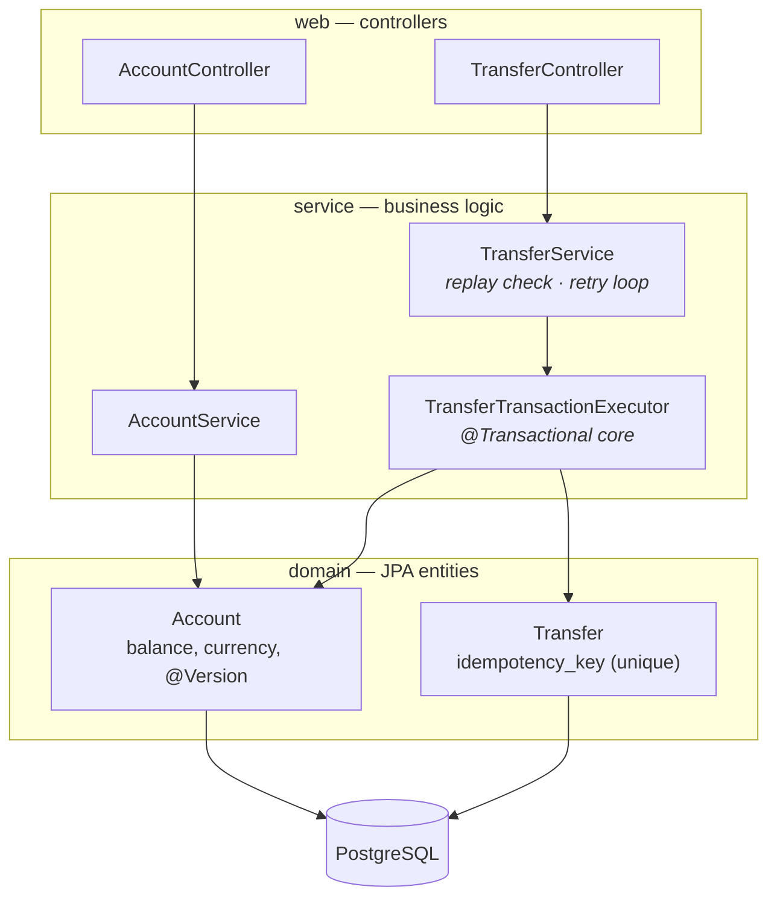

# Transfer API

<p>
  
  
  
  
  
</p>

A REST API for account-to-account money transfers. The interesting part isn't
moving money between two columns — it's that the client on the other end of
this API is conceptually a **POS terminal on a bad network**: it retries
requests it isn't sure got through, and the server must guarantee it never
charges a customer twice for the same swipe.

That guarantee — **idempotency under concurrency** — is the actual subject of
this project.

## Table of contents

- [Why idempotency, specifically](#why-idempotency-specifically)
- [How a transfer stays safe under retries and races](#how-a-transfer-stays-safe-under-retries-and-races)
- [Architecture](#architecture)
- [API](#api)
- [Quickstart](#quickstart)
- [Testing](#testing)
- [Tech stack](#tech-stack)
- [Project status](#project-status)

## Why idempotency, specifically

A payment terminal sends `POST /transfers`, the network hiccups, and the
terminal never sees the response. It doesn't know if the transfer happened —
so it does the only safe thing: it retries the **exact same request**. If the
server treats that retry as a brand-new transfer, the customer gets charged
twice.

The fix is a client-supplied `Idempotency-Key` header. The server remembers
every key it has seen and the result it produced, so a retry doesn't
re-execute anything — it just gets the original answer back.

## How a transfer stays safe under retries and races

```mermaid
sequenceDiagram
    actor Terminal as POS Terminal
    participant API as Transfer API
    participant DB as PostgreSQL

    Terminal->>API: POST /transfers (Idempotency-Key: abc123)
    API->>DB: SELECT ... WHERE idempotency_key = 'abc123'
    DB-->>API: not found
    API->>DB: BEGIN; debit from, credit to; INSERT transfer; COMMIT
    Note over API,DB: unique constraint on idempotency_key<br/>backstops a racing duplicate insert
    DB-->>API: OK
    API-->>Terminal: 201 Created

    Note over Terminal: network drops the response —<br/>terminal doesn't know it succeeded

    Terminal->>API: POST /transfers (same Idempotency-Key: abc123)
    API->>DB: SELECT ... WHERE idempotency_key = 'abc123'
    DB-->>API: found — same transfer
    API-->>Terminal: 200 OK (original result, nothing re-executed)
```

Three mechanisms work together, each covering a failure mode the others don't:

| Mechanism | Covers |
|---|---|
| **Idempotency-key replay** | The common case — client didn't see the response and retries later, after the first request already committed. |
| **Unique DB constraint + race recovery** | Two requests with the same brand-new key arrive *at the same instant* — both pass the replay check, but only one wins the insert; the loser re-queries and returns the winner's result instead of erroring. |
| **Optimistic locking (`@Version`) + retry** | Two *different* transfers touch the same account concurrently (e.g. two customers paying into the same merchant account). Each account row is version-checked at commit; a losing transaction reloads fresh balances and retries, up to 3 attempts. |

A key can only be replayed for the **exact same payload** (same accounts, same
amount). Reusing a key with a different request is rejected with `422` — that
distinction matters, because silently returning someone else's transfer for a
mismatched replay would be a much worse bug than no idempotency at all.

## Architecture



- **`domain/`** — JPA entities. `Account` owns its own invariants (`debit()`
  throws rather than letting a service short-circuit a balance check).
- **`repository/`** — plain Spring Data JPA repositories.
- **`service/`** — split in two on purpose: `TransferTransactionExecutor` is
  the `@Transactional` unit of work; `TransferService` orchestrates the
  replay check and retry loop *around* it, and is deliberately **not**
  transactional itself — each retry needs its own fresh transaction.
- **`web/`** — thin controllers: validation and status codes only.
- **`exception/`** — domain exceptions mapped to
  [RFC 7807](https://www.rfc-editor.org/rfc/rfc9457) `ProblemDetail`
  responses by a single `@RestControllerAdvice`.

Schema is owned entirely by Flyway migrations (`src/main/resources/db/migration`);
Hibernate is `ddl-auto=validate` only — it never generates DDL.

## API

| Method | Path | Description |
|---|---|---|
| `POST` | `/accounts` | Open an account |
| `GET` | `/accounts/{id}` | Get an account |
| `POST` | `/accounts/{id}/deposit` | Deposit funds |
| `POST` | `/transfers` | Transfer between two accounts (requires `Idempotency-Key` header) |
| `GET` | `/transfers?accountId=&page=` | Paginated transfer history for an account |

<details>
<summary><strong>curl walkthrough</strong></summary>

```bash
# open two accounts
curl -s -X POST localhost:8080/accounts \
  -H "Content-Type: application/json" \
  -d '{"owner":"Alice","initialBalance":100.00,"currency":"EUR"}'
# -> {"id":1,"owner":"Alice","balance":100.00,"currency":"EUR"}

curl -s -X POST localhost:8080/accounts \
  -H "Content-Type: application/json" \
  -d '{"owner":"Bob","initialBalance":0,"currency":"EUR"}'
# -> {"id":2,"owner":"Bob","balance":0.00,"currency":"EUR"}

# transfer 30.00 from Alice to Bob
curl -s -X POST localhost:8080/transfers \
  -H "Content-Type: application/json" \
  -H "Idempotency-Key: 6c1f6e2a-0000-4c00-8000-000000000001" \
  -d '{"fromAccountId":1,"toAccountId":2,"amount":30.00}'
# -> 201 Created {"id":1,"fromAccountId":1,"toAccountId":2,"amount":30.00,"status":"COMPLETED",...}

# retry the exact same request — same key, same body
curl -s -X POST localhost:8080/transfers \
  -H "Content-Type: application/json" \
  -H "Idempotency-Key: 6c1f6e2a-0000-4c00-8000-000000000001" \
  -d '{"fromAccountId":1,"toAccountId":2,"amount":30.00}'
# -> 200 OK, same transfer id — Bob was NOT credited twice

# reuse the key with a different amount — rejected, not silently replayed
curl -s -X POST localhost:8080/transfers \
  -H "Content-Type: application/json" \
  -H "Idempotency-Key: 6c1f6e2a-0000-4c00-8000-000000000001" \
  -d '{"fromAccountId":1,"toAccountId":2,"amount":999.00}'
# -> 422 Unprocessable Content (RFC 7807 problem+json)

# paginated history
curl -s "localhost:8080/transfers?accountId=1&page=0&size=20"
```

</details>

## Quickstart

```bash
docker compose up -d postgres     # Postgres only, for now — see Project status
./gradlew bootRun
```

The app needs Postgres to start at all — schema is Flyway-managed and
`ddl-auto=validate`, so there's no in-memory fallback.

## Testing

```bash
./gradlew test --tests "com.slavaslava.transferapi.service.*" \
                --tests "com.slavaslava.transferapi.domain.*"   # unit tests, no DB needed

docker compose up -d postgres
./gradlew test                                                  # full suite, incl. integration tests
```

- **Unit tests** (JUnit 5 + Mockito) cover the service layer in isolation:
  replay/retry/race branches of `TransferService`, the debit/credit/validation
  rules in `TransferTransactionExecutor`, and `Account`'s own invariants.
- **Integration tests** (`@SpringBootTest`, real Postgres) prove the two
  claims that actually matter for this project: retrying `POST /transfers`
  with the same key never double-debits, and two threads racing a transfer
  against the same account never overdraw or double-spend it.

## Tech stack

Java 21 · Spring Boot 4 · Gradle · PostgreSQL + Flyway · JUnit 5 + Mockito ·
Docker Compose · GitHub Actions · springdoc-openapi

## Project status

**Phase 1 — core**
- [x] Accounts, transfers, deposits, paginated history
- [x] Idempotency-key replay with payload match check
- [x] Optimistic locking with retry on concurrent transfers
- [x] RFC 7807 error responses
- [x] Unit tests (Mockito) + integration tests (idempotency, concurrency)
- [ ] Dockerfile + full docker-compose (app + Postgres)
- [ ] GitHub Actions CI running the full suite on every push
- [ ] OpenAPI UI (springdoc)

**Phase 2 — extensions** (after phase 1 ships): Redis idempotency cache +
rate limiting, Spring Security, Actuator/Prometheus/Grafana, Testcontainers.

**Phase 3**: a C client simulating a POS terminal — HTTP retries reusing the
same idempotency key end-to-end.

See [`CLAUDE.md`](CLAUDE.md) for implementation-level notes (known gaps,
stack-specific gotchas).
