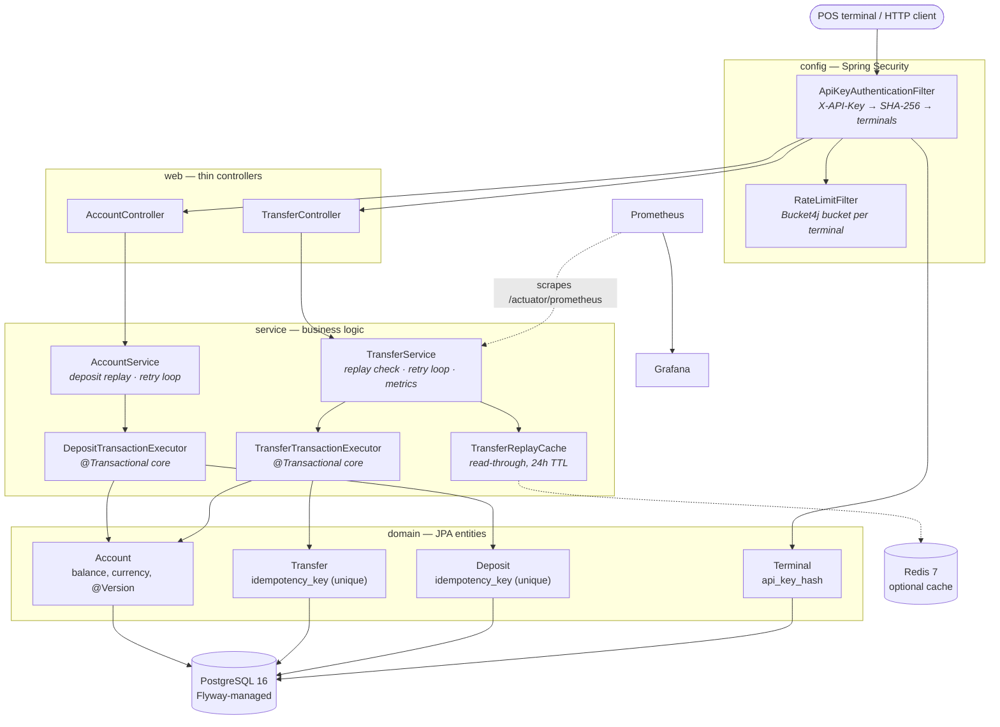
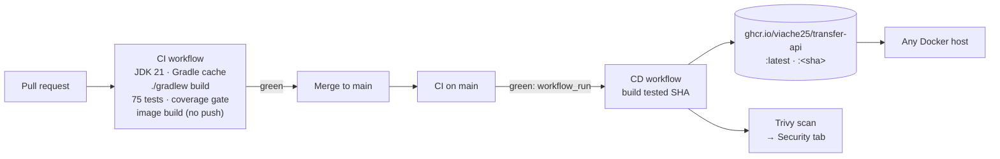

# Transfer API

<p>
  <a href="https://github.com/viache25/transfer-api/actions/workflows/ci.yml"></a>
  <a href="https://github.com/viache25/transfer-api/actions/workflows/cd.yml"></a>
  <a href="https://github.com/viache25/transfer-api/actions/workflows/nightly.yml"></a>
  <a href="https://github.com/viache25/transfer-api/actions/workflows/mutation.yml"></a>
  
  
  
  
  
  
</p>

A REST API for account-to-account money transfers, built as a complete,
production-shaped service: domain logic, security, automated tests, CI/CD,
container delivery and observability.

The client on the other end of this API is conceptually a **POS terminal on a
bad network**. It retries requests it isn't sure got through, and the server
must guarantee it never charges a customer twice for the same swipe. That
guarantee, **idempotency under concurrency**, is the core subject of the
project, and the test suite is built to prove it.

## Table of contents

- [Highlights](#highlights)
- [Why idempotency, specifically](#why-idempotency-specifically)
- [How a transfer stays safe under retries and races](#how-a-transfer-stays-safe-under-retries-and-races)
- [Architecture](#architecture)
- [API](#api)
- [Authentication](#authentication)
- [Quickstart](#quickstart)
- [Testing and quality](#testing-and-quality)
- [CI/CD pipeline](#cicd-pipeline)
- [Monitoring](#monitoring)
- [Deploying to a server](#deploying-to-a-server)
- [Repository layout](#repository-layout)
- [Tech stack](#tech-stack)
- [Project status and roadmap](#project-status-and-roadmap)

## Highlights

| Area | What's in place |
|---|---|
| **Correctness** | Idempotent transfers and deposits (`Idempotency-Key`), payload-mismatch rejection (422), optimistic locking with automatic retry, DB-level race backstop |
| **Testing** | 50 unit tests (JUnit 5 + Mockito), 16 integration tests on a real PostgreSQL 16 and Redis 7 started by Testcontainers (including multi-threaded race tests), and 9 black-box API tests (REST Assured) checked against the app's own OpenAPI spec, including a network-failure test that cuts the response with Toxiproxy after the commit |
| **CI** | GitHub Actions quality gate on every pull request and push to `main`: full suite, JaCoCo coverage floor (line ≥ 85%, branch ≥ 80%), JUnit results published on the PR, production Docker image built (not pushed) |
| **CD** | Runs only after CI is green on `main`; builds the exact tested commit into a multi-stage Docker image, publishes it to GitHub Container Registry tagged with the commit SHA, scans it with Trivy (results in the Security tab) |
| **Security** | Per-terminal API keys (`X-API-Key`), stored as SHA-256 hashes, enforced by a Spring Security filter; per-terminal rate limit (429 + `Retry-After`); 401s rendered as RFC 7807 |
| **API contract** | OpenAPI 3 spec and Swagger UI; all errors as RFC 7807 `application/problem+json` |
| **Observability** | Actuator health, Micrometer business counters, Prometheus scraping, pre-provisioned Grafana dashboard with latency percentiles |
| **Data** | Schema owned by Flyway migrations; Hibernate runs in `validate` mode only |
| **Caching** | Redis read-through cache (24h TTL) in front of the transfer idempotency lookup; the database stays the source of truth and any Redis failure silently falls back to it |

## Why idempotency, specifically

A payment terminal sends `POST /transfers`, the network hiccups, and the
terminal never sees the response. It doesn't know whether the transfer
happened, so it does the only safe thing: it retries the **exact same
request**. If the server treats that retry as a brand-new transfer, the
customer is charged twice.

The fix is a client-supplied `Idempotency-Key` header. The server remembers
every key it has seen and the result it produced, so a retry doesn't
re-execute anything. It gets the original answer back.

## How a transfer stays safe under retries and races

```mermaid
sequenceDiagram
    actor Terminal as POS Terminal
    participant API as Transfer API
    participant DB as PostgreSQL

    Terminal->>API: POST /transfers (Idempotency-Key: abc123)
    API->>DB: SELECT ... WHERE idempotency_key = 'abc123'
    DB-->>API: not found
    API->>DB: BEGIN; debit from, credit to; INSERT transfer; COMMIT
    Note over API,DB: unique constraint on idempotency_key<br/>backstops a racing duplicate insert
    DB-->>API: OK
    API-->>Terminal: 201 Created

    Note over Terminal: network drops the response —<br/>terminal doesn't know it succeeded

    Terminal->>API: POST /transfers (same Idempotency-Key: abc123)
    API->>DB: SELECT ... WHERE idempotency_key = 'abc123'
    DB-->>API: found — same transfer
    API-->>Terminal: 200 OK (original result, nothing re-executed)
```

Three mechanisms work together, each covering a failure mode the others don't:

| Mechanism | Covers |
|---|---|
| **Idempotency-key replay** | The common case: the client didn't see the response and retries later, after the first request already committed. |
| **Unique DB constraint + race recovery** | Two requests with the same brand-new key arrive at the same instant. Both pass the replay check, only one wins the insert; the loser re-queries and returns the winner's result instead of an error. |
| **Optimistic locking (`@Version`) + retry** | Two *different* operations touch the same account concurrently. Each account row is version-checked at commit; the losing transaction reloads fresh balances and retries, up to 3 attempts. |

A key can only be replayed for the **exact same payload**. Reusing a key with
a different request is rejected with `422`, because silently returning
someone else's result for a mismatched replay would be a worse bug than no
idempotency at all.

Deposits follow the same rules when an `Idempotency-Key` header is supplied.

The dropped-response scenario in the diagram is reproduced for real by
`NetworkFailureIdempotencyApiTest`. Toxiproxy sits between a test HTTP client
and the running app and cuts the connection once the response starts, which is
after the commit. The client retries with the same key and gets `200` with the
same transfer id, and the balances show the money moved exactly once.

## Architecture


```mermaid
flowchart TB
    Client([POS terminal / HTTP client])

    subgraph security ["config — Spring Security"]
        F["ApiKeyAuthenticationFilter<br/><i>X-API-Key → SHA-256 → terminals</i>"]
        RL["RateLimitFilter<br/><i>Bucket4j bucket per terminal</i>"]
        F --> RL
    end

    subgraph web ["web — thin controllers"]
        AC[AccountController]
        TC[TransferController]
    end

    subgraph service ["service — business logic"]
        AS["AccountService<br/><i>deposit replay · retry loop</i>"]
        DX["DepositTransactionExecutor<br/><i>@Transactional core</i>"]
        TS["TransferService<br/><i>replay check · retry loop · metrics</i>"]
        TX["TransferTransactionExecutor<br/><i>@Transactional core</i>"]
        RC["TransferReplayCache<br/><i>read-through, 24h TTL</i>"]
    end

    subgraph domain ["domain — JPA entities"]
        ACC["Account<br/>balance, currency, @Version"]
        TRF["Transfer<br/>idempotency_key (unique)"]
        DEP["Deposit<br/>idempotency_key (unique)"]
        TER["Terminal<br/>api_key_hash"]
    end

    DB[(PostgreSQL 16<br/>Flyway-managed)]
    REDIS[(Redis 7<br/>optional cache)]
    PROM[Prometheus] --> GRAF[Grafana]

    Client --> F --> AC & TC
    AC --> AS --> DX --> ACC & DEP
    TC --> TS --> TX --> ACC & TRF
    TS --> RC -.-> REDIS
    F --> TER
    ACC & TRF & DEP & TER --> DB
    PROM -. scrapes /actuator/prometheus .-> TS
```

The POS terminal on the left is a conceptual client. Its behaviour on a flaky
network (a lost response, then a retry with the same key) is exercised by the
Toxiproxy network-failure test in `src/apiTest`.

- **`domain/`**: JPA entities. `Account` owns its invariants (`debit()`
  throws instead of letting a service skip a balance check).
- **`service/`**: split in two on purpose. The `*TransactionExecutor` classes
  are the `@Transactional` unit of work; `TransferService` and `AccountService`
  orchestrate replay and retry *around* them and are deliberately **not**
  transactional, because each retry needs its own fresh transaction.
- **`web/`**: thin controllers, validation and status codes only.
- **`exception/`**: domain exceptions mapped to
  [RFC 7807](https://www.rfc-editor.org/rfc/rfc9457) `ProblemDetail`
  responses by one `@RestControllerAdvice`.
- **`config/`**: security filter chain, API-key hashing, dev-profile terminal
  seeding, per-terminal rate limiting, OpenAPI definition.
- **Redis**: `TransferReplayCache` answers transfer replays before the
  database is queried. It is an optimisation only; any Redis error falls back
  to PostgreSQL.

The schema lives entirely in Flyway migrations
(`src/main/resources/db/migration`, `V1`–`V3`); Hibernate never generates DDL.

## API

| Method | Path | Description |
|---|---|---|
| `POST` | `/accounts` | Open an account |
| `GET` | `/accounts/{id}` | Get an account |
| `POST` | `/accounts/{id}/deposit` | Deposit funds (idempotent when an `Idempotency-Key` header is supplied) |
| `POST` | `/transfers` | Transfer between two accounts (requires `Idempotency-Key`) |
| `GET` | `/transfers?accountId=&page=` | Paginated transfer history for an account |

Interactive docs: **`/swagger-ui.html`** (Swagger UI) and **`/v3/api-docs`**
(OpenAPI JSON). Both are public; the `X-API-Key` scheme and the
`Idempotency-Key` header are documented on every endpoint that needs them.

<details>
<summary><strong>curl walkthrough</strong></summary>

```bash
API_KEY=dev-local-terminal-key   # seeded automatically in the dev profile

# open two accounts
curl -s -X POST localhost:8080/accounts \
  -H "Content-Type: application/json" -H "X-API-Key: $API_KEY" \
  -d '{"owner":"Alice","initialBalance":100.00,"currency":"EUR"}'
# -> {"id":1,"owner":"Alice","balance":100.00,"currency":"EUR"}

curl -s -X POST localhost:8080/accounts \
  -H "Content-Type: application/json" -H "X-API-Key: $API_KEY" \
  -d '{"owner":"Bob","initialBalance":0,"currency":"EUR"}'
# -> {"id":2,"owner":"Bob","balance":0,"currency":"EUR"}

# transfer 30.00 from Alice to Bob
curl -s -X POST localhost:8080/transfers \
  -H "Content-Type: application/json" -H "X-API-Key: $API_KEY" \
  -H "Idempotency-Key: 6c1f6e2a-0000-4c00-8000-000000000001" \
  -d '{"fromAccountId":1,"toAccountId":2,"amount":30.00}'
# -> 201 Created {"id":1,"fromAccountId":1,"toAccountId":2,"amount":30.00,"status":"COMPLETED",...}

# retry the exact same request: same key, same body
curl -s -X POST localhost:8080/transfers \
  -H "Content-Type: application/json" -H "X-API-Key: $API_KEY" \
  -H "Idempotency-Key: 6c1f6e2a-0000-4c00-8000-000000000001" \
  -d '{"fromAccountId":1,"toAccountId":2,"amount":30.00}'
# -> 200 OK, same transfer id; Bob was NOT credited twice

# reuse the key with a different amount: rejected, not replayed
curl -s -X POST localhost:8080/transfers \
  -H "Content-Type: application/json" -H "X-API-Key: $API_KEY" \
  -H "Idempotency-Key: 6c1f6e2a-0000-4c00-8000-000000000001" \
  -d '{"fromAccountId":1,"toAccountId":2,"amount":999.00}'
# -> 422 Unprocessable Content (RFC 7807 problem+json)

# paginated history
curl -s "localhost:8080/transfers?accountId=1&page=0&size=20" -H "X-API-Key: $API_KEY"
```

</details>

## Authentication

Every endpoint except `/actuator/health`, `/actuator/prometheus`,
`/v3/api-docs/**` and `/swagger-ui/**` requires a per-terminal API key in the
`X-API-Key` header. Keys are stored only as SHA-256 hashes in the `terminals`
table and checked by a stateless Spring Security filter. A missing or unknown
key gets a `401` RFC 7807 response.

Each terminal is also rate limited (Bucket4j token bucket, 20 requests per
second by default, configurable via `app.rate-limit.requests-per-second`).
A terminal over its limit gets `429 Too Many Requests` as an RFC 7807 response
with a `Retry-After` header (seconds). Buckets are held in memory, so the limit
applies per application instance.

The `dev` Spring profile (enabled in `docker-compose.yml`) seeds one terminal
with the key `dev-local-terminal-key`. That seeder never runs outside `dev`.
In other environments, add a terminal by inserting its name and key hash
(see [Deploying to a server](#deploying-to-a-server)).

## Quickstart

Requirements: Docker. Nothing else.

```bash
git clone https://github.com/viache25/transfer-api && cd transfer-api
docker compose up
```

| Service | URL |
|---|---|
| API | http://localhost:8080 |
| Swagger UI | http://localhost:8080/swagger-ui.html |
| Grafana (dashboard "Transfer API") | http://localhost:3000 |
| Prometheus | http://localhost:9090 |
| Redis (idempotency cache) | localhost:6379 |

Or run the published image instead of building locally (needs a Postgres it
can reach; Redis is optional, the app falls back to the database without it):

```bash
docker run -p 8080:8080 \
  -e SPRING_DATASOURCE_URL=jdbc:postgresql://<host>:5432/transferapi \
  -e SPRING_DATASOURCE_USERNAME=transferapi \
  -e SPRING_DATASOURCE_PASSWORD=transferapi \
  -e SPRING_DATA_REDIS_HOST=<redis-host> \
  ghcr.io/viache25/transfer-api:latest
```

For a fast edit/run loop without rebuilding the image:

```bash
docker compose up -d postgres redis
./gradlew bootRun --args='--spring.profiles.active=dev'
```

## Testing and quality

```bash
./gradlew test      # full suite; needs Docker running, nothing else
./gradlew test --tests "com.slavaslava.transferapi.service.*" \
               --tests "com.slavaslava.transferapi.domain.*" \
               --tests "com.slavaslava.transferapi.dto.*" \
               --tests "com.slavaslava.transferapi.config.*"   # unit tests only, no Docker
./gradlew apiTest   # REST Assured API tests only; needs Docker
./gradlew build     # compile + all tests (incl. apiTest) + package (what CI runs)
./gradlew pitest    # mutation testing of service/ and domain/ (unit tests only, no Docker)
```

HTML reports after a run: `build/reports/tests/test/index.html` (tests) and
`build/reports/jacoco/test/html/index.html` (coverage).

### Coverage gate

JaCoCo measures coverage on every test run. `./gradlew check` (and therefore
`build` and CI) fails if line coverage drops below **85%** or branch coverage
below **80%**. Current values: line 88%, branch 84%. The floors sit a few
points below the measured values so a small refactor doesn't break the build,
but a feature merged without tests does.

### Test strategy

The suite follows the test pyramid: many fast, isolated unit tests for every
branch of the business logic, and fewer integration tests that prove the
system-level guarantees against a real database.

| Level | Count | Tools | What it proves |
|---|---|---|---|
| **Unit** | 50 | JUnit 5, Mockito, AssertJ | Every branch of replay, retry and race handling; validation rules; account invariants; rate-limit buckets and the 429 filter |
| **Integration** | 16 | `@SpringBootTest`, MockMvc, Testcontainers (PostgreSQL 16, Redis 7) | End-to-end HTTP behaviour, idempotency, security, and concurrency against a real database |
| **API** | 9 | REST Assured, `@SpringBootTest(RANDOM_PORT)`, Testcontainers, Toxiproxy | The real HTTP surface over a socket: status codes, `problem+json` bodies, replay, pagination, a contract check of every response against `/v3/api-docs`, and a lost response after the commit recovered by a same-key retry |

Integration tests start their own disposable PostgreSQL 16 and Redis 7 containers through
Testcontainers (`@ServiceConnection`), so they are hermetic: no shared dev
database, no leftover state, identical behaviour on a laptop and in CI.

### What is covered

**Idempotency**
- A retried transfer with the same key returns the same transfer and never debits twice
- A retried deposit with the same key credits exactly once
- Reusing a key with a different payload is rejected (422) and executes nothing
- Two requests racing with the same new key: the loser returns the winner's result
- The network loses the response after the server committed (Toxiproxy closes the connection after the first response byte): the client gets an I/O error, the retry with the same key gets `200` with the same transfer id, and the money moved exactly once

**Concurrency**
- Two threads transferring 80.00 from a 100.00 account at the same instant: exactly one succeeds, the balance never goes negative (threads released together with a `CountDownLatch`)
- A deposit racing a transfer on the same account completes without a concurrency error
- Optimistic-lock conflicts are retried and succeed; after 3 failed attempts the error propagates

**Business rules**
- Insufficient funds, currency mismatch, same-account transfer, missing accounts
- Debit/credit invariants on the `Account` entity itself

**Security**
- No API key → 401 ProblemDetail; unknown key → 401; valid key → accepted
- A terminal exceeding its request rate gets 429 ProblemDetail with `Retry-After`; other terminals are unaffected

**API tests (`src/apiTest`, task `apiTest`, wired into `check`)**
- Create account, transfer 201, replay 200 with the same id, key reuse 422 `problem+json`, missing API key 401, insufficient funds 409, paginated history
- Success responses are validated against the app's own `/v3/api-docs`: the operation must be documented and every declared response property present with the right JSON type
- Network failure (`NetworkFailureIdempotencyApiTest`): Toxiproxy runs in a container between a JDK `HttpClient` "terminal" and the app. A `limit_data` toxic cuts the first response after the commit, then the same-key retry is checked to replay and not re-execute

**Schema and startup**
- The application context starts against a Flyway-migrated database with Hibernate in `validate` mode, so any drift between entities and migrations fails the build

### Mutation testing

Coverage says which lines ran, not whether the tests would notice a bug.
[PIT](https://pitest.org) mutates the business logic (flips comparisons, removes
calls, changes return values) and re-runs the unit tests against every mutant;
a mutant no test fails on is a gap. `./gradlew pitest` targets `service/` and
`domain/`, uses only the Docker-free unit tests, and writes
`build/reports/pitest/index.html`. It is intentionally not part of `check`
(too slow for every PR); instead [`mutation.yml`](.github/workflows/mutation.yml)
runs it weekly and on demand, writes the score to the run summary and uploads
the HTML report as an artifact.

| Metric | Value |
|---|---|
| Mutants generated | 81 |
| Mutation coverage (killed / all) | 73 / 81 = **90%** |
| Test strength (killed / mutants reached by a test) | 73 / 73 = **100%** |
| Line coverage of the mutated classes | 156 / 177 = 88% |

Measured on 2026-10-04. The first run found one surviving mutant: changing
`balance < amount` to `balance <= amount` in `Account.debit()` went unnoticed,
because no test debited the exact balance. A boundary test now kills it. The 8
remaining mutants are never reached by a unit test: simple getters and two
read-only service methods (`getAccount`, `listTransfers`), which are covered by
the integration and API tests instead. PIT's run only uses the Docker-free unit
tests, so it can't see those.

## CI/CD pipeline


```mermaid
flowchart LR
    PR[Pull request] --> CI["CI workflow<br/>JDK 21 · Gradle cache<br/>./gradlew build<br/>75 tests · coverage gate<br/>image build (no push)"]
    CI -->|green| M[Merge to main]
    M --> CI2["CI on main"]
    CI2 -->|green: workflow_run| CD["CD workflow<br/>build tested SHA"]
    CD --> R[("ghcr.io/viache25/transfer-api<br/>:latest · :&lt;sha&gt;")]
    CD --> T["Trivy scan<br/>→ Security tab"]
    R --> S[Any Docker host]
```

| Workflow | Trigger | What it does |
|---|---|---|
| [`ci.yml`](.github/workflows/ci.yml) | Pull request to `main`, push to `main`, manual | Sets up JDK 21 with Gradle caching, runs `./gradlew build` (compile, all unit, integration and API tests, coverage gate, packaging). Publishes JUnit results (unit, integration and API tests) as a check on the PR, writes a coverage summary to the run page, uploads HTML test and coverage reports as artifacts. A second job builds the production Docker image exactly like CD does, without pushing it, and checks that it contains the executable Spring Boot jar, so a broken `Dockerfile` fails the PR instead of the release. A newer push cancels the superseded run. A red build blocks the merge. |
| [`cd.yml`](.github/workflows/cd.yml) | CI finished successfully on `main` (`workflow_run`), manual | Checks out exactly the commit CI tested (`workflow_run.head_sha`), builds the multi-stage `Dockerfile` (Gradle `bootJar` build stage → slim JRE 21 runtime, non-root user; no tests in the image build, CI already ran them) and pushes it to GitHub Container Registry, tagged `latest` and with the short commit SHA for traceable rollbacks. Then scans the pushed image with Trivy (HIGH/CRITICAL, report-only for now) and uploads the SARIF report to the repository's Security tab. A red CI run on `main` never produces an image. |
| [`dependabot.yml`](.github/dependabot.yml) | Weekly | Opens update PRs for Gradle dependencies (minor/patch grouped into one PR), GitHub Actions versions and the Dockerfile base images. Each PR goes through the same CI gate, so an update that breaks a test or drops coverage can't be merged. |
| [`nightly.yml`](.github/workflows/nightly.yml) | Daily 02:00 UTC, manual | Full `./gradlew build --rerun-tasks` with no task-cache hits, even when nothing was pushed. Catches flaky tests (the concurrency tests run every night, not only when code changes) and drift from outside the repo: new base images, dependency or Testcontainers changes. |
| [`mutation.yml`](.github/workflows/mutation.yml) | Mondays 03:00 UTC, manual | Runs `./gradlew pitest` (mutation testing of `service/` and `domain/`), writes mutants, mutation coverage and test strength to the run summary and uploads `build/reports/pitest/` as the `pitest-report` artifact. |

## Monitoring

`docker compose up` also starts Prometheus and Grafana (configuration under
`ops/`). Prometheus scrapes `/actuator/prometheus` every 5 seconds; Grafana
comes with the datasource and a "Transfer API" dashboard already provisioned.

| Metric | Meaning |
|---|---|
| `transfers_created_count_total` | New transfers executed |
| `transfers_replayed_total` | Retries answered from a stored result |
| `transfers_lock_retries_total` | Optimistic-lock conflicts that triggered a retry |
| `transfers_key_reuse_rejected_total` | Key reused with a different payload (422) |
| `http_server_requests_seconds_*` | Request rate and p50/p95/p99 latency |

## Deploying to a server

The image from GHCR runs on any Linux host with Docker. For a production-like
setup, start from `docker-compose.yml` and change four things:

1. Use `image: ghcr.io/viache25/transfer-api:latest` instead of `build: .`
2. Remove `SPRING_PROFILES_ACTIVE=dev` so no well-known dev key is seeded
3. Move database passwords into an `.env` file and stop publishing port 5432
4. Disable Grafana's anonymous admin access

Then create a terminal key:

```bash
KEY=$(openssl rand -hex 24); echo "API key: $KEY"
HASH=$(printf %s "$KEY" | sha256sum | cut -d' ' -f1)
docker compose exec postgres psql -U transferapi -c \
  "INSERT INTO terminals(name, api_key_hash, created_at) VALUES ('terminal-1', '$HASH', now());"
```

Put a TLS-terminating reverse proxy (for example Caddy) in front of port 8080.
Updating to a new version is `docker compose pull && docker compose up -d`.

## Repository layout

```
.github/workflows/   CI and CD pipelines
src/main/java/...    web · service · domain · repository · dto · exception · config
src/main/resources/  application.properties, Flyway migrations (V1–V3)
src/test/java/...    unit tests (service/, domain/) and integration tests (root package)
src/apiTest/java/... REST Assured API tests, OpenAPI contract check, Toxiproxy network-failure test
ops/                 Prometheus scrape config, Grafana provisioning and dashboard
Dockerfile           multi-stage build (bootJar only) → JRE 21 runtime, non-root
docker-compose.yml   app + PostgreSQL + Redis + Prometheus + Grafana
CLAUDE.md            implementation notes and stack-specific gotchas
```

## Tech stack

**Application:** Java 21 · Spring Boot 4.1 / Spring Framework 7 · Spring Data
JPA / Hibernate 7 · Spring Security · Bucket4j · Jackson 3 · Bean Validation

**Data:** PostgreSQL 16 · Flyway · Redis 7 (Spring Data Redis / Lettuce)

**Testing:** JUnit 5 · Mockito · AssertJ · MockMvc · REST Assured ·
Testcontainers · Toxiproxy · Spring Security Test · JaCoCo · PIT

**Delivery:** Gradle (Kotlin DSL) · Docker (multi-stage) · Docker Compose ·
GitHub Actions · GitHub Container Registry · Trivy

**API and observability:** OpenAPI 3 / springdoc · RFC 7807 · Spring Boot
Actuator · Micrometer · Prometheus · Grafana

## Project status and roadmap

**Done**
- [x] Accounts, transfers, deposits, paginated history
- [x] Idempotent transfers and deposits with payload-match check
- [x] Optimistic locking with retry; DB-level race recovery
- [x] RFC 7807 error responses
- [x] Unit tests + Testcontainers integration tests (idempotency, concurrency, security)
- [x] Per-terminal API-key authentication (Spring Security)
- [x] OpenAPI spec + Swagger UI
- [x] Dockerfile + full Docker Compose stack
- [x] CI on GitHub Actions; CD to GitHub Container Registry
- [x] Actuator, custom metrics, Prometheus + Grafana dashboard
- [x] Redis read-through cache for transfer idempotency lookups (DB stays source of truth)
- [x] Per-terminal rate limiting (Bucket4j, 20 req/s, 429 with `Retry-After`)

**Phases**
- Phase 1 (core: idempotency, optimistic-lock retry, concurrency tests, Docker, CI/CD): done
- Phase 2 (security, Testcontainers, observability, Redis cache, rate limiting): done
- Phase 3 (POS-terminal client): done differently. Per D8 the C client was replaced by a Java network-failure test with Toxiproxy

**Next**
- [x] Exact replay bodies and fixed two-decimal money scale
- [x] REST Assured API tests with an OpenAPI contract check
- [x] Mutation testing with PIT (`./gradlew pitest`, not part of `check`)
- [x] Network-failure idempotency test with Toxiproxy: the first response is cut after the commit, the retry returns the same transfer
- [ ] k6 load test with deliberate same-key retries
- [ ] A single server-rendered test-target page and Playwright UI tests
- [ ] Ephemeral-environment smoke test against the published image

Out of scope by design: message brokers, microservices, a frontend,
Kubernetes, currency conversion.
