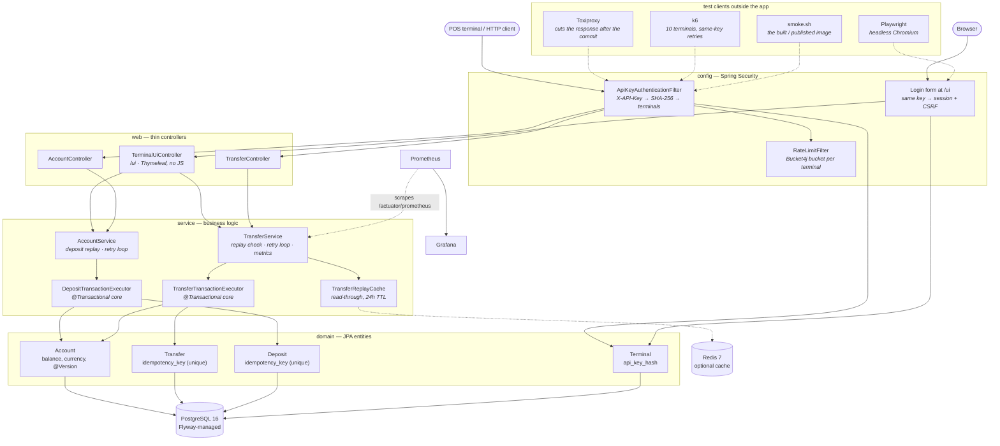
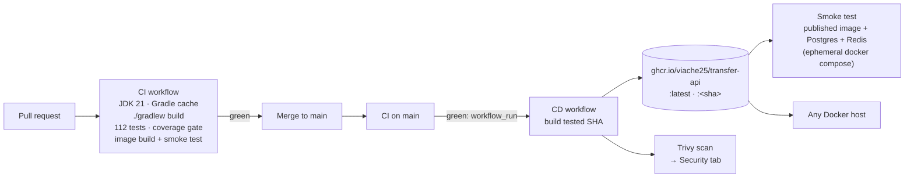

# Transfer API

<p>
  <a href="https://github.com/viache25/transfer-api/actions/workflows/ci.yml"></a>
  <a href="https://github.com/viache25/transfer-api/actions/workflows/cd.yml"></a>
  <a href="https://github.com/viache25/transfer-api/actions/workflows/nightly.yml"></a>
  <a href="https://github.com/viache25/transfer-api/actions/workflows/mutation.yml"></a>
  <a href="https://github.com/viache25/transfer-api/actions/workflows/load.yml"></a>
  
  
  
  
  
  
</p>

A REST API for account-to-account money transfers, built as a complete,
production-shaped service: domain logic, security, automated tests, CI/CD,
container delivery and observability.

The client on the other end of this API is conceptually a **POS terminal on a
bad network**. It retries requests it isn't sure got through, and the server
must guarantee it never charges a customer twice for the same swipe. That
guarantee, **idempotency under concurrency**, is the core subject of the
project, and the test suite is built to prove it.

## Table of contents

- [Highlights](#highlights)
- [Why idempotency, specifically](#why-idempotency-specifically)
- [How a transfer stays safe under retries and races](#how-a-transfer-stays-safe-under-retries-and-races)
- [Architecture](#architecture)
- [API](#api)
- [Authentication](#authentication)
- [Quickstart](#quickstart)
- [Testing and quality](#testing-and-quality)
- [CI/CD pipeline](#cicd-pipeline)
- [Monitoring](#monitoring)
- [Deploying to a server](#deploying-to-a-server)
- [Repository layout](#repository-layout)
- [Tech stack](#tech-stack)
- [Project status and roadmap](#project-status-and-roadmap)

## Highlights

| Area | What's in place |
|---|---|
| **Correctness** | Idempotent transfers and deposits (`Idempotency-Key`), payload-mismatch rejection (422), optimistic locking with automatic retry, DB-level race backstop |
| **Testing** | 69 unit tests (JUnit 5 + Mockito), 30 integration tests on a real PostgreSQL 16 and Redis 7 started by Testcontainers (including multi-threaded race tests), and 9 black-box API tests (REST Assured) checked against the app's own OpenAPI spec, including a network-failure test that cuts the response with Toxiproxy after the commit; 4 Playwright UI tests driving the `/ui` page in headless Chromium; a k6 load test with deliberate same-key retries that reconciles the ledger afterwards |
| **CI** | GitHub Actions quality gate on every pull request and push to `main`: full suite, JaCoCo coverage floor (line ≥ 85%, branch ≥ 80%), JUnit results published on the PR, production Docker image built (not pushed) and smoke-tested |
| **CD** | Runs only after CI is green on `main`; builds the exact tested commit into a multi-stage Docker image, publishes it to GitHub Container Registry tagged with the commit SHA, scans it with Trivy (results in the Security tab), then starts the published image in an ephemeral Docker Compose environment and smoke-tests it |
| **Security** | Per-terminal API keys (`X-API-Key`), stored as SHA-256 hashes, enforced by a Spring Security filter; the terminal UI page signs in with the same key into a CSRF-protected server-side session; per-terminal rate limit (429 + `Retry-After`); 401s rendered as RFC 7807 |
| **API contract** | OpenAPI 3 spec and Swagger UI; all errors as RFC 7807 `application/problem+json` |
| **Observability** | Actuator health, Micrometer business counters, Prometheus scraping, pre-provisioned Grafana dashboard with latency percentiles |
| **Data** | Schema owned by Flyway migrations; Hibernate runs in `validate` mode only |
| **Caching** | Redis read-through cache (24h TTL) in front of the transfer idempotency lookup; the database stays the source of truth and any Redis failure silently falls back to it |

## Why idempotency, specifically

A payment terminal sends `POST /transfers`, the network hiccups, and the
terminal never sees the response. It doesn't know whether the transfer
happened, so it does the only safe thing: it retries the **exact same
request**. If the server treats that retry as a brand-new transfer, the
customer is charged twice.

The fix is a client-supplied `Idempotency-Key` header. The server remembers
every key it has seen and the result it produced, so a retry doesn't
re-execute anything. It gets the original answer back.

## How a transfer stays safe under retries and races

```mermaid
sequenceDiagram
    actor Terminal as POS Terminal
    participant API as Transfer API
    participant DB as PostgreSQL

    Terminal->>API: POST /transfers (Idempotency-Key: abc123)
    API->>DB: SELECT ... WHERE idempotency_key = 'abc123'
    DB-->>API: not found
    API->>DB: BEGIN; debit from, credit to; INSERT transfer; COMMIT
    Note over API,DB: unique constraint on idempotency_key<br/>backstops a racing duplicate insert
    DB-->>API: OK
    API-->>Terminal: 201 Created

    Note over Terminal: network drops the response —<br/>terminal doesn't know it succeeded

    Terminal->>API: POST /transfers (same Idempotency-Key: abc123)
    API->>DB: SELECT ... WHERE idempotency_key = 'abc123'
    DB-->>API: found — same transfer
    API-->>Terminal: 200 OK (original result, nothing re-executed)
```

Three mechanisms work together, each covering a failure mode the others don't:

| Mechanism | Covers |
|---|---|
| **Idempotency-key replay** | The common case: the client didn't see the response and retries later, after the first request already committed. |
| **Unique DB constraint + race recovery** | Two requests with the same brand-new key arrive at the same instant. Both pass the replay check, only one wins the insert; the loser re-queries and returns the winner's result instead of an error. |
| **Optimistic locking (`@Version`) + retry** | Two *different* operations touch the same account concurrently. Each account row is version-checked at commit; the losing transaction reloads fresh balances and retries, up to 3 attempts. Account rows are always updated in id order, so two opposite transfers (A→B and B→A) can't deadlock, and a lock failure is retried like a version conflict. |

A key can only be replayed for the **exact same payload**. Reusing a key with
a different request is rejected with `422`, because silently returning
someone else's result for a mismatched replay would be a worse bug than no
idempotency at all.

Deposits follow the same rules when an `Idempotency-Key` header is supplied.

The dropped-response scenario in the diagram is reproduced for real by
`NetworkFailureIdempotencyApiTest`. Toxiproxy sits between a test HTTP client
and the running app and cuts the connection once the response starts, which is
after the commit. The client retries with the same key and gets `200` with the
same transfer id, and the balances show the money moved exactly once.

## Architecture


```mermaid
flowchart TB
    Client([POS terminal / HTTP client])

    subgraph security ["config — Spring Security"]
        F["ApiKeyAuthenticationFilter<br/><i>X-API-Key → SHA-256 → terminals</i>"]
        RL["RateLimitFilter<br/><i>Bucket4j bucket per terminal</i>"]
        F --> RL
        UL["Login form at /ui<br/><i>same key → session + CSRF</i>"]
    end

    subgraph web ["web — thin controllers"]
        AC[AccountController]
        TC[TransferController]
        UI["TerminalUiController<br/><i>/ui · Thymeleaf, no JS</i>"]
    end

    subgraph service ["service — business logic"]
        AS["AccountService<br/><i>deposit replay · retry loop</i>"]
        DX["DepositTransactionExecutor<br/><i>@Transactional core</i>"]
        TS["TransferService<br/><i>replay check · retry loop · metrics</i>"]
        TX["TransferTransactionExecutor<br/><i>@Transactional core</i>"]
        RC["TransferReplayCache<br/><i>read-through, 24h TTL</i>"]
    end

    subgraph domain ["domain — JPA entities"]
        ACC["Account<br/>balance, currency, @Version"]
        TRF["Transfer<br/>idempotency_key (unique)"]
        DEP["Deposit<br/>idempotency_key (unique)"]
        TER["Terminal<br/>api_key_hash"]
    end

    DB[(PostgreSQL 16<br/>Flyway-managed)]
    REDIS[(Redis 7<br/>optional cache)]
    PROM[Prometheus] --> GRAF[Grafana]

    subgraph harness ["test clients outside the app"]
        TOX["Toxiproxy<br/><i>cuts the response after the commit</i>"]
        K6["k6<br/><i>10 terminals, same-key retries</i>"]
        SMK["smoke.sh<br/><i>the built / published image</i>"]
        PW["Playwright<br/><i>headless Chromium</i>"]
    end

    Client --> F --> AC & TC
    Browser([Browser]) --> UL --> UI --> AS & TS
    AC --> AS --> DX --> ACC & DEP
    TC --> TS --> TX --> ACC & TRF
    TS --> RC -.-> REDIS
    F & UL --> TER
    ACC & TRF & DEP & TER --> DB
    PROM -. scrapes /actuator/prometheus .-> TS
    TOX & K6 & SMK -.-> F
    PW -.-> UL
```

The POS terminal on the left is a conceptual client. Its behaviour on a flaky
network (a lost response, then a retry with the same key) is exercised by the
Toxiproxy network-failure test in `src/apiTest`. A fleet of them under load,
retrying with the same key, is simulated by the k6 load test in `load/`. The
browser at `/ui` is a single server-rendered terminal page (D9), the target of
the Playwright UI tests. It calls the same services as the REST controllers.
`scripts/smoke.sh` checks the real Docker image end to end on every PR and
after every release. The dotted "test clients" in the diagram are all of
these.

- **`domain/`**: JPA entities. `Account` owns its invariants (`debit()`
  throws instead of letting a service skip a balance check).
- **`service/`**: split in two on purpose. The `*TransactionExecutor` classes
  are the `@Transactional` unit of work; `TransferService` and `AccountService`
  orchestrate replay and retry *around* them and are deliberately **not**
  transactional, because each retry needs its own fresh transaction.
- **`web/`**: thin controllers, validation and status codes only. `web/ui/`
  holds the terminal page controller (Thymeleaf templates in
  `src/main/resources/templates/ui/`).
- **`exception/`**: domain exceptions mapped to
  [RFC 7807](https://www.rfc-editor.org/rfc/rfc9457) `ProblemDetail`
  responses by one `@RestControllerAdvice`.
- **`config/`**: security filter chain, API-key hashing, dev-profile terminal
  seeding, per-terminal rate limiting, OpenAPI definition.
- **Redis**: `TransferReplayCache` answers transfer replays before the
  database is queried. It is an optimisation only; any Redis error falls back
  to PostgreSQL.

The schema lives entirely in Flyway migrations
(`src/main/resources/db/migration`, `V1`–`V3`); Hibernate never generates DDL.

## API

| Method | Path | Description |
|---|---|---|
| `POST` | `/accounts` | Open an account |
| `GET` | `/accounts/{id}` | Get an account |
| `POST` | `/accounts/{id}/deposit` | Deposit funds (idempotent when an `Idempotency-Key` header is supplied) |
| `POST` | `/transfers` | Transfer between two accounts (requires `Idempotency-Key`) |
| `GET` | `/transfers?accountId=&page=` | Paginated transfer history for an account |
| `GET` | `/ui` | Terminal page (HTML, sign-in with the API key): accounts, a transfer form, "retry with same key", history |

Interactive docs: **`/swagger-ui.html`** (Swagger UI) and **`/v3/api-docs`**
(OpenAPI JSON). Both are public; the `X-API-Key` scheme and the
`Idempotency-Key` header are documented on every endpoint that needs them.

<details>
<summary><strong>curl walkthrough</strong></summary>

```bash
API_KEY=dev-local-terminal-key   # seeded automatically in the dev profile

# open two accounts
curl -s -X POST localhost:8080/accounts \
  -H "Content-Type: application/json" -H "X-API-Key: $API_KEY" \
  -d '{"owner":"Alice","initialBalance":100.00,"currency":"EUR"}'
# -> {"id":1,"owner":"Alice","balance":100.00,"currency":"EUR"}

curl -s -X POST localhost:8080/accounts \
  -H "Content-Type: application/json" -H "X-API-Key: $API_KEY" \
  -d '{"owner":"Bob","initialBalance":0,"currency":"EUR"}'
# -> {"id":2,"owner":"Bob","balance":0,"currency":"EUR"}

# transfer 30.00 from Alice to Bob
curl -s -X POST localhost:8080/transfers \
  -H "Content-Type: application/json" -H "X-API-Key: $API_KEY" \
  -H "Idempotency-Key: 6c1f6e2a-0000-4c00-8000-000000000001" \
  -d '{"fromAccountId":1,"toAccountId":2,"amount":30.00}'
# -> 201 Created {"id":1,"fromAccountId":1,"toAccountId":2,"amount":30.00,"status":"COMPLETED",...}

# retry the exact same request: same key, same body
curl -s -X POST localhost:8080/transfers \
  -H "Content-Type: application/json" -H "X-API-Key: $API_KEY" \
  -H "Idempotency-Key: 6c1f6e2a-0000-4c00-8000-000000000001" \
  -d '{"fromAccountId":1,"toAccountId":2,"amount":30.00}'
# -> 200 OK, same transfer id; Bob was NOT credited twice

# reuse the key with a different amount: rejected, not replayed
curl -s -X POST localhost:8080/transfers \
  -H "Content-Type: application/json" -H "X-API-Key: $API_KEY" \
  -H "Idempotency-Key: 6c1f6e2a-0000-4c00-8000-000000000001" \
  -d '{"fromAccountId":1,"toAccountId":2,"amount":999.00}'
# -> 422 Unprocessable Content (RFC 7807 problem+json)

# paginated history
curl -s "localhost:8080/transfers?accountId=1&page=0&size=20" -H "X-API-Key: $API_KEY"
```

</details>

## Authentication

Every endpoint except `/actuator/health`, `/actuator/prometheus`,
`/v3/api-docs/**` and `/swagger-ui/**` requires a per-terminal API key in the
`X-API-Key` header. Keys are stored only as SHA-256 hashes in the `terminals`
table and checked by a stateless Spring Security filter. A missing or unknown
key gets a `401` RFC 7807 response. The `/ui` pages take the same key through
a login form instead of the header (see [Terminal UI](#terminal-ui-ui)).

Each terminal is also rate limited (Bucket4j token bucket, 20 requests per
second by default, configurable via `app.rate-limit.requests-per-second`).
A terminal over its limit gets `429 Too Many Requests` as an RFC 7807 response
with a `Retry-After` header (seconds). Buckets are held in memory, so the limit
applies per application instance.

The `dev` Spring profile (enabled in `docker-compose.yml`) seeds one terminal
with the key `dev-local-terminal-key`. That seeder never runs outside `dev`.
In other environments, add a terminal by inserting its name and key hash
(see [Deploying to a server](#deploying-to-a-server)).

### Terminal UI (`/ui`)

`/ui` is one server-rendered page (Thymeleaf, no JavaScript, no build step).
It exists as a target for the Playwright UI tests (D9), not as a product. It
lists the newest accounts, sends a transfer with a freshly generated
`Idempotency-Key`, offers **Retry with the same key** for the last attempt
(a replay shows `Replayed (200)` with the same transfer id), and shows an
account's transfer history.

A browser can't attach an `X-API-Key` header to page loads and form posts, so
the page has its own small login. The terminal types its API key once into
`/ui/login`. The key is checked exactly like the header (SHA-256 hash lookup
in `terminals`), and the server keeps the authenticated terminal in an HTTP
session. The key never goes into a cookie, local storage or a URL. The session
cookie is `HttpOnly` and `SameSite=Strict` (add `Secure` behind TLS with
`server.servlet.session.cookie.secure=true`), and its id is rotated at login.
Because a session cookie is sent automatically, every form post carries a CSRF
token. A strict Content-Security-Policy allows no scripts at all. The UI has
its own security filter chain for `/ui/**` only: the JSON API stays stateless
and still accepts nothing but `X-API-Key`, so a UI session can't call it.

## Quickstart

Requirements: Docker. Nothing else.

```bash
git clone https://github.com/viache25/transfer-api && cd transfer-api
docker compose up
scripts/smoke.sh   # optional, in a second terminal: 7 end-to-end checks against the running stack
```

| Service | URL |
|---|---|
| API | http://localhost:8080 |
| Swagger UI | http://localhost:8080/swagger-ui.html |
| Terminal UI (sign in with `dev-local-terminal-key`) | http://localhost:8080/ui |
| Grafana (dashboard "Transfer API") | http://localhost:3000 |
| Prometheus | http://localhost:9090 |
| Redis (idempotency cache) | localhost:6379 |

Or run the published image instead of building locally (needs a Postgres it
can reach; Redis is optional, the app falls back to the database without it):

```bash
docker run -p 8080:8080 \
  -e SPRING_DATASOURCE_URL=jdbc:postgresql://<host>:5432/transferapi \
  -e SPRING_DATASOURCE_USERNAME=transferapi \
  -e SPRING_DATASOURCE_PASSWORD=transferapi \
  -e SPRING_DATA_REDIS_HOST=<redis-host> \
  ghcr.io/viache25/transfer-api:latest
```

For a fast edit/run loop without rebuilding the image:

```bash
docker compose up -d postgres redis
./gradlew bootRun --args='--spring.profiles.active=dev'
```

## Testing and quality

```bash
./gradlew test      # full suite; needs Docker running, nothing else
./gradlew test --tests "com.slavaslava.transferapi.service.*" \
               --tests "com.slavaslava.transferapi.domain.*" \
               --tests "com.slavaslava.transferapi.dto.*" \
               --tests "com.slavaslava.transferapi.config.*" \
               --tests "com.slavaslava.transferapi.web.*"      # unit tests only, no Docker
./gradlew apiTest   # REST Assured API tests only; needs Docker
./gradlew uiTest    # Playwright UI tests only; needs Docker (installs Chromium on first run)
./gradlew build     # compile + all tests (incl. apiTest and uiTest) + package (what CI runs)
./gradlew pitest    # mutation testing of service/ and domain/ (unit tests only, no Docker)

scripts/smoke.sh                       # smoke test against a running app (default: docker compose up on :8080)
scripts/smoke-ephemeral.sh <image>     # start <image> + PostgreSQL + Redis, provision a key, smoke test, tear down
k6 run -e API_KEYS="$(load/provision-terminals.sh 10)" load/transfers.js   # load test against docker compose up (see load/README.md)
```

HTML reports after a run: `build/reports/tests/test/index.html` (tests) and
`build/reports/jacoco/test/html/index.html` (coverage). A failed UI test leaves
a full-page screenshot and a Playwright trace in `build/reports/playwright/`
(open the trace at [trace.playwright.dev](https://trace.playwright.dev)).

### Coverage gate

JaCoCo measures coverage on every test run. `./gradlew check` (and therefore
`build` and CI) fails if line coverage drops below **85%** or branch coverage
below **80%**. Current values: line 94%, branch 88%. The floors sit a few
points below the measured values so a small refactor doesn't break the build,
but a feature merged without tests does.

### Test strategy

The suite follows the test pyramid: many fast, isolated unit tests for every
branch of the business logic, and fewer integration tests that prove the
system-level guarantees against a real database.

| Level | Count | Tools | What it proves |
|---|---|---|---|
| **Unit** | 69 | JUnit 5, Mockito, AssertJ, standalone MockMvc | Every branch of replay, retry and race handling (including a deadlock victim being retried); validation rules; account invariants; rate-limit buckets and the 429 filter; the terminal page controller and its Thymeleaf templates with mocked services |
| **Integration** | 30 | `@SpringBootTest`, MockMvc, Testcontainers (PostgreSQL 16, Redis 7) | End-to-end HTTP behaviour, idempotency, security, and concurrency against a real database, including the row-lock order that keeps opposite transfers from deadlocking; the terminal page with its real security chain (API-key login, session, CSRF, CSP) |
| **API** | 9 | REST Assured, `@SpringBootTest(RANDOM_PORT)`, Testcontainers, Toxiproxy | The real HTTP surface over a socket: status codes, `problem+json` bodies, replay, pagination, a contract check of every response against `/v3/api-docs`, and a lost response after the commit recovered by a same-key retry |
| **UI** | 4 | Playwright for Java (headless Chromium), `@SpringBootTest(RANDOM_PORT)`, Testcontainers | The `/ui` terminal page in a real browser: sign in with the API key, a transfer shown with its id and in the history, **Retry with the same key** showing the same id with the money moved once, the insufficient-funds message, a rejected key. Screenshot + trace of every failure |
| **Smoke** | 7 checks | Bash, curl, jq, Docker Compose | The real Docker image, started with PostgreSQL and Redis in the production profile: health, 401, accounts, transfer, same-key replay (balances moved once), key reuse 422. Runs on every PR (locally built image) and after every release (published image) |
| **Load** | 1 scenario | k6, Docker Compose | 10 terminals with their own API keys for 60s; 20% of transfers retried with the same key, 5% sent twice concurrently. Thresholds: p95 latency, error rate < 1%, zero idempotency violations, and a ledger reconciliation afterwards (total conserved, every balance explained by the recorded transfers, no key executed twice). Weekly, on demand, and on PRs that touch `load/` ([details and results](load/README.md)) |

Integration tests start their own disposable PostgreSQL 16 and Redis 7 containers through
Testcontainers (`@ServiceConnection`), so they are hermetic: no shared dev
database, no leftover state, identical behaviour on a laptop and in CI.

### What is covered

**Idempotency**
- A retried transfer with the same key returns the same transfer and never debits twice
- A retried deposit with the same key credits exactly once
- Reusing a key with a different payload is rejected (422) and executes nothing
- Two requests racing with the same new key: the loser returns the winner's result
- The network loses the response after the server committed (Toxiproxy closes the connection after the first response byte): the client gets an I/O error, the retry with the same key gets `200` with the same transfer id, and the money moved exactly once

**Concurrency**
- Two threads transferring 80.00 from a 100.00 account at the same instant: exactly one succeeds, the balance never goes negative (threads released together with a `CountDownLatch`)
- A deposit racing a transfer on the same account completes without a concurrency error
- Optimistic-lock conflicts and deadlock victims are retried and succeed; after 3 failed attempts the error propagates as 409
- A transfer locks its two account rows in id order whatever its direction, so opposite transfers can't deadlock (found by the k6 load test)

**Business rules**
- Insufficient funds, currency mismatch, same-account transfer, missing accounts
- Debit/credit invariants on the `Account` entity itself

**Security**
- No API key → 401 ProblemDetail; unknown key → 401; valid key → accepted
- A server error inside an authorized request is reported as itself (500), not as a 401 from the error page

**Terminal UI (`/ui`, MockMvc)**
- Without a session every page redirects to the login form; an `X-API-Key` header doesn't open it
- The right API key starts a session; an unknown or missing key is rejected; forms without a CSRF token get 403; logout ends the session
- A transfer is shown with its id; **Retry with the same key** shows `Replayed (200)` with the same id and the money moved once; insufficient funds is shown as an error message; the history lists the account's transfers
- A terminal exceeding its request rate gets 429 ProblemDetail with `Retry-After`; other terminals are unaffected

**API tests (`src/apiTest`, task `apiTest`, wired into `check`)**
- Create account, transfer 201, replay 200 with the same id, key reuse 422 `problem+json`, missing API key 401, insufficient funds 409, paginated history
- Success responses are validated against the app's own `/v3/api-docs`: the operation must be documented and every declared response property present with the right JSON type
- Network failure (`NetworkFailureIdempotencyApiTest`): Toxiproxy runs in a container between a JDK `HttpClient` "terminal" and the app. A `limit_data` toxic cuts the first response after the commit, then the same-key retry is checked to replay and not re-execute

**UI tests (`src/uiTest`, task `uiTest`, wired into `check`)**
- Sign in on `/ui/login` with the terminal's API key; a wrong key shows "Unknown API key."
- A transfer shows `Created (201)` with its id, updates both balances and appears in the history
- **Retry with the same key** shows `Replayed (200)` with the same transfer id and key, and the balances moved once
- Insufficient funds shows the error message and leaves the balance untouched

**Load (`load/transfers.js`, k6)**
- Under concurrent load from 10 terminals, every same-key retry (sequential or concurrent) returns the original transfer id and never a second `201`
- After the run, the total balance is conserved, every account's balance equals its opening balance plus its recorded transfers, and no `Idempotency-Key` appears twice
- p95 latency and error-rate thresholds; measured numbers in [load/README.md](load/README.md#results)

**Schema and startup**
- The application context starts against a Flyway-migrated database with Hibernate in `validate` mode, so any drift between entities and migrations fails the build

### Mutation testing

Coverage says which lines ran, not whether the tests would notice a bug.
[PIT](https://pitest.org) mutates the business logic (flips comparisons, removes
calls, changes return values) and re-runs the unit tests against every mutant;
a mutant no test fails on is a gap. `./gradlew pitest` targets `service/` and
`domain/`, uses only the Docker-free unit tests, and writes
`build/reports/pitest/index.html`. It is intentionally not part of `check`
(too slow for every PR); instead [`mutation.yml`](.github/workflows/mutation.yml)
runs it weekly and on demand, writes the score to the run summary and uploads
the HTML report as an artifact.

| Metric | Value |
|---|---|
| Mutants generated | 82 |
| Mutation coverage (detected / all) | 74 / 82 = **90%** |
| Test strength (detected / mutants reached by a test) | 74 / 74 = **100%** |
| Line coverage of the mutated classes | 159 / 180 = 88% |

Measured on 2026-10-05 (run 37270441812). Of the 74 detected mutants, 72 were
killed by a failing test. The other 2 timed out: removing `++failedAttempts`
from a retry loop makes it spin forever, which PIT counts as detected. The
first run (2026-10-04) found one surviving mutant: changing
`balance < amount` to `balance <= amount` in `Account.debit()` went unnoticed,
because no test debited the exact balance. A boundary test now kills it. The 8
remaining mutants are never reached by a unit test: simple getters and two
read-only service methods (`getAccount`, `listTransfers`), which are covered by
the integration and API tests instead. PIT's run only uses the Docker-free unit
tests, so it can't see those.

## CI/CD pipeline


```mermaid
flowchart LR
    PR[Pull request] --> CI["CI workflow<br/>JDK 21 · Gradle cache<br/>./gradlew build<br/>112 tests · coverage gate<br/>image build + smoke test"]
    CI -->|green| M[Merge to main]
    M --> CI2["CI on main"]
    CI2 -->|green: workflow_run| CD["CD workflow<br/>build tested SHA"]
    CD --> R[("ghcr.io/viache25/transfer-api<br/>:latest · :&lt;sha&gt;")]
    CD --> T["Trivy scan<br/>→ Security tab"]
    R --> SM["Smoke test<br/>published image + Postgres + Redis<br/>(ephemeral docker compose)"]
    R --> S[Any Docker host]
```

| Workflow | Trigger | What it does |
|---|---|---|
| [`ci.yml`](.github/workflows/ci.yml) | Pull request to `main`, push to `main`, manual | Sets up JDK 21 with Gradle caching, runs `./gradlew build` (compile, all unit, integration, API and Playwright UI tests, coverage gate, packaging; the build installs headless Chromium and its OS libraries itself). Publishes JUnit results (unit, integration, API and UI tests) as a check on the PR, writes a coverage summary to the run page, uploads HTML test and coverage reports, plus the screenshot and trace of any failed UI test, as artifacts. A second job builds the production Docker image exactly like CD does, without pushing it, checks that it contains the executable Spring Boot jar and runs the same ephemeral-environment smoke test CD runs, so a broken `Dockerfile` or image fails the PR instead of the release. A newer push cancels the superseded run. A red build blocks the merge. |
| [`cd.yml`](.github/workflows/cd.yml) | CI finished successfully on `main` (`workflow_run`), manual | Checks out exactly the commit CI tested (`workflow_run.head_sha`), builds the multi-stage `Dockerfile` (Gradle `bootJar` build stage → slim JRE 21 runtime, non-root user; no tests in the image build, CI already ran them) and pushes it to GitHub Container Registry, tagged `latest` and with the short commit SHA for traceable rollbacks. Then scans the pushed image with Trivy (HIGH/CRITICAL, report-only for now) and uploads the SARIF report to the repository's Security tab. A second job (`smoke`) pulls the image it just pushed (by digest), starts it with PostgreSQL and Redis through `docker-compose.smoke.yml` in the production profile, provisions a terminal key in the database and runs `scripts/smoke.sh` against it (D10: an ephemeral environment instead of a paid server). A red CI run on `main` never produces an image. |
| [`dependabot.yml`](.github/dependabot.yml) | Weekly | Opens update PRs for Gradle dependencies (minor/patch grouped into one PR), GitHub Actions versions and the Dockerfile base images. Each PR goes through the same CI gate, so an update that breaks a test or drops coverage can't be merged. |
| [`nightly.yml`](.github/workflows/nightly.yml) | Daily 02:00 UTC, manual | Full `./gradlew build --rerun-tasks` with no task-cache hits, even when nothing was pushed. Catches flaky tests (the concurrency tests run every night, not only when code changes) and drift from outside the repo: new base images, dependency or Testcontainers changes. |
| [`mutation.yml`](.github/workflows/mutation.yml) | Mondays 03:00 UTC, manual | Runs `./gradlew pitest` (mutation testing of `service/` and `domain/`), writes mutants, mutation coverage and test strength to the run summary and uploads `build/reports/pitest/` as the `pitest-report` artifact. |
| [`load.yml`](.github/workflows/load.yml) | Sundays 04:00 UTC, manual, pull requests that change `load/` | Starts the Docker Compose stack, provisions 10 terminal keys and runs the k6 load test (`load/transfers.js`) for 60s: p95 latency, error rate, idempotency and ledger thresholds. Writes requests, throughput, p95/p99 and the idempotency counters to the run summary and uploads the k6 summary and HTML report as the `k6-report` artifact. Not a per-PR gate: shared-runner latency is too noisy to block unrelated changes on. |

## Monitoring

`docker compose up` also starts Prometheus and Grafana (configuration under
`ops/`). Prometheus scrapes `/actuator/prometheus` every 5 seconds; Grafana
comes with the datasource and a "Transfer API" dashboard already provisioned.

| Metric | Meaning |
|---|---|
| `transfers_created_count_total` | New transfers executed |
| `transfers_replayed_total` | Retries answered from a stored result |
| `transfers_lock_retries_total` | Optimistic-lock conflicts that triggered a retry |
| `transfers_key_reuse_rejected_total` | Key reused with a different payload (422) |
| `http_server_requests_seconds_*` | Request rate and p50/p95/p99 latency |

## Deploying to a server

The image from GHCR runs on any Linux host with Docker. For a production-like
setup, start from `docker-compose.yml` and change four things:

1. Use `image: ghcr.io/viache25/transfer-api:latest` instead of `build: .`
2. Remove `SPRING_PROFILES_ACTIVE=dev` so no well-known dev key is seeded
3. Move database passwords into an `.env` file and stop publishing port 5432
4. Disable Grafana's anonymous admin access

Then create a terminal key:

```bash
KEY=$(openssl rand -hex 24); echo "API key: $KEY"
HASH=$(printf %s "$KEY" | sha256sum | cut -d' ' -f1)
docker compose exec postgres psql -U transferapi -c \
  "INSERT INTO terminals(name, api_key_hash, created_at) VALUES ('terminal-1', '$HASH', now());"
```

Put a TLS-terminating reverse proxy (for example Caddy) in front of port 8080.
Updating to a new version is `docker compose pull && docker compose up -d`.
Afterwards, `BASE_URL=https://<your-host> API_KEY=$KEY scripts/smoke.sh` checks
the deployment end to end. It creates two small test accounts and one transfer.

CD runs this same procedure on every release in a throwaway environment:
`scripts/smoke-ephemeral.sh` starts the published image with PostgreSQL and
Redis (`docker-compose.smoke.yml`), inserts a terminal key as above, runs the
smoke test and tears everything down.

## Repository layout

```
.github/workflows/   CI, CD, nightly, mutation-testing and load-test workflows
src/main/java/...    web · service · domain · repository · dto · exception · config
src/main/resources/  application.properties, Flyway migrations (V1–V3), Thymeleaf templates + CSS of the /ui page
src/test/java/...    unit tests (service/, domain/) and integration tests (root package)
src/apiTest/java/... REST Assured API tests, OpenAPI contract check, Toxiproxy network-failure test
src/uiTest/java/...  Playwright UI tests of the /ui terminal page
ops/                 Prometheus scrape config, Grafana provisioning and dashboard
Dockerfile           multi-stage build (bootJar only) → JRE 21 runtime, non-root
docker-compose.yml   app + PostgreSQL + Redis + Prometheus + Grafana
docker-compose.smoke.yml  ephemeral smoke-test environment: a given image + PostgreSQL + Redis
scripts/             smoke.sh (HTTP smoke test), smoke-ephemeral.sh (compose up → key → smoke → down)
load/                k6 load test (transfers.js), terminal-key provisioning, how to run it
CLAUDE.md            implementation notes and stack-specific gotchas
```

## Tech stack

**Application:** Java 21 · Spring Boot 4.1 / Spring Framework 7 · Spring Data
JPA / Hibernate 7 · Spring Security · Bucket4j · Jackson 3 · Bean Validation ·
Thymeleaf (one test-target page)

**Data:** PostgreSQL 16 · Flyway · Redis 7 (Spring Data Redis / Lettuce)

**Testing:** JUnit 5 · Mockito · AssertJ · MockMvc · REST Assured ·
Testcontainers · Toxiproxy · Playwright for Java · Spring Security Test · JaCoCo ·
PIT · k6

**Delivery:** Gradle (Kotlin DSL) · Docker (multi-stage) · Docker Compose ·
GitHub Actions · GitHub Container Registry · Trivy

**API and observability:** OpenAPI 3 / springdoc · RFC 7807 · Spring Boot
Actuator · Micrometer · Prometheus · Grafana

## Project status and roadmap

**Done**
- [x] Accounts, transfers, deposits, paginated history
- [x] Idempotent transfers and deposits with payload-match check
- [x] Optimistic locking with retry; DB-level race recovery
- [x] RFC 7807 error responses
- [x] Unit tests + Testcontainers integration tests (idempotency, concurrency, security)
- [x] Per-terminal API-key authentication (Spring Security)
- [x] OpenAPI spec + Swagger UI
- [x] Dockerfile + full Docker Compose stack
- [x] CI on GitHub Actions; CD to GitHub Container Registry
- [x] Actuator, custom metrics, Prometheus + Grafana dashboard
- [x] Redis read-through cache for transfer idempotency lookups (DB stays source of truth)
- [x] Per-terminal rate limiting (Bucket4j, 20 req/s, 429 with `Retry-After`)
- [x] Deadlock-free transfers: account rows are locked in id order (found by the k6 load test)

**Phases**
- Phase 1 (core: idempotency, optimistic-lock retry, concurrency tests, Docker, CI/CD): done
- Phase 2 (security, Testcontainers, observability, Redis cache, rate limiting): done
- Phase 3 (POS-terminal client): done differently. Per D8 the C client was replaced by a Java network-failure test with Toxiproxy
- Extensions (exact replay, REST Assured, PIT, Toxiproxy, k6, the `/ui` page, Playwright, ephemeral smoke test): done

**Extension plan (steps 17–24 of issue #1, all done; 13–15 skipped per D8)**
- [x] Exact replay bodies and fixed two-decimal money scale
- [x] REST Assured API tests with an OpenAPI contract check
- [x] Mutation testing with PIT (`./gradlew pitest`, not part of `check`)
- [x] Network-failure idempotency test with Toxiproxy: the first response is cut after the commit, the retry returns the same transfer
- [x] k6 load test with deliberate same-key retries and a ledger reconciliation afterwards
- [x] A single server-rendered test-target page (`/ui`, Thymeleaf, signed in with the terminal's API key)
- [x] Playwright UI tests against that page (headless Chromium, screenshot + trace on failure)
- [x] Ephemeral-environment smoke test against the published image (CD) and the PR image (CI)

Out of scope by design: message brokers, microservices, a frontend (beyond
the single test-target page from D9), Kubernetes, currency conversion.
